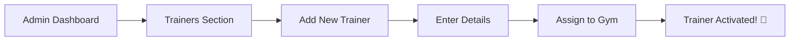
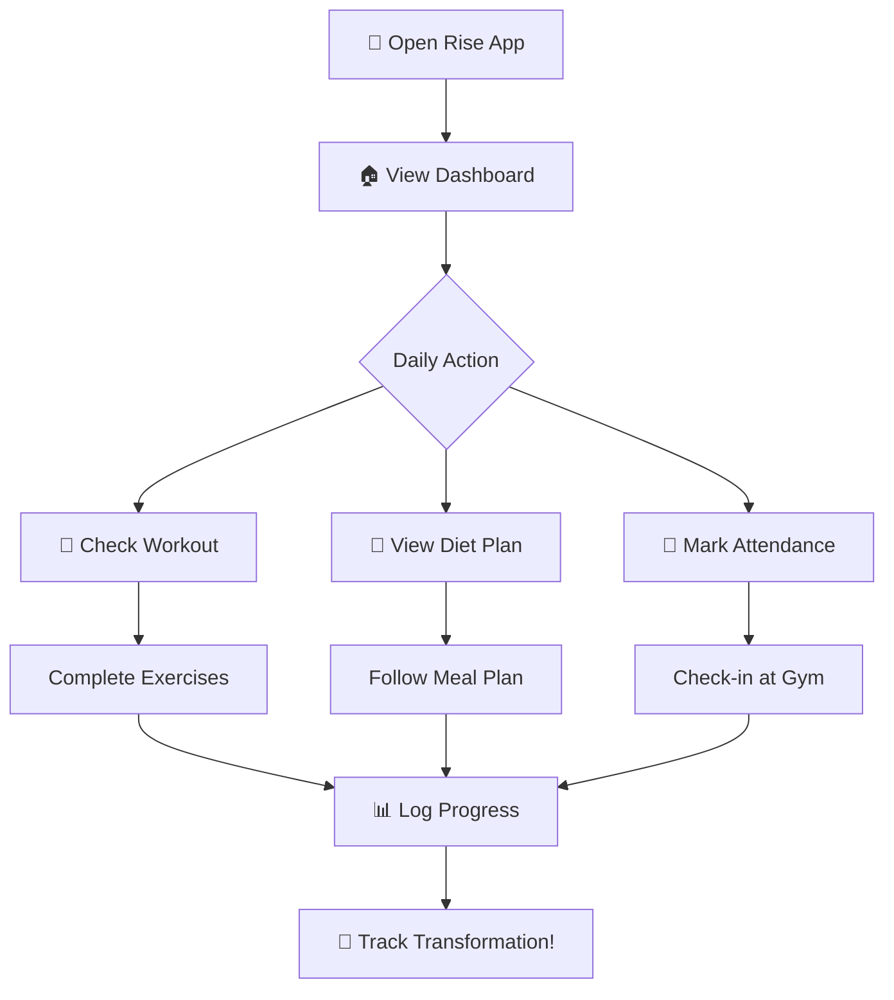

# 🏋️‍♂️ Rise Fitness — The Journey of Transformation

> *"Where every workout counts, every meal matters, and every member rises."*

---

## 📖 The Story of Rise

### Chapter 1: The Vision 🌅

Imagine a world where gym management becomes seamless, where trainers connect effortlessly with their members, and where every fitness journey is meticulously tracked. This is **Rise Fitness** — not just an app, but a complete ecosystem designed to revolutionize how fitness centers operate.

---

## 🎭 The Characters

Our story has four heroes, each with their unique role in the fitness universe:

### 👑 The Superuser — *The Architect*
The one who sees everything. The Superuser is like the gym's guardian angel, overseeing the entire empire from the clouds. They hold the master keys to the kingdom.

### 🛡️ The Admin — *The Commander*
The boots on the ground. Admins run the day-to-day operations, ensuring the gym runs like a well-oiled machine. They're the bridge between leadership and execution.

### 💪 The Trainer — *The Guide*
The transformation artists. Trainers are the mentors who design the roadmaps to fitness, crafting personalized workout and diet plans that turn dreams into reality.

### 🔥 The Member — *The Hero*
Every member is the protagonist of their own fitness story. Rise is built for them — to track, motivate, and celebrate their journey.

---

## 🎬 Act I: The Grand Opening

### Scene 1: The Superuser Awakens

```
Once upon a time, a gym owner named Khush decided to revolutionize 
their fitness empire. They logged into Rise Fitness for the first time...
```

**🌐 The Portal Opens**

When the Superuser signs in, they're greeted by a stunning dashboard — a command center bathed in elegant dark themes with glassmorphism effects that shimmer like starlight.

```
┌──────────────────────────────────────────────────────────────┐
│  🏠 Welcome back, Khush! 👑                                   │
│  Here's what's happening in your gym today.                   │
│                                                               │
│  ┌─────────────┐ ┌─────────────┐ ┌─────────────┐             │
│  │ 👥 Members  │ │ 💪 Trainers │ │ 🛡️ Admins   │             │
│  │     247     │ │      12     │ │      3      │             │
│  └─────────────┘ └─────────────┘ └─────────────┘             │
│                                                               │
│  ┌─────────────┐ ┌─────────────┐ ┌─────────────┐             │
│  │ 🏋️ Workouts │ │ 🥗 Diets    │ │ 📊 Active   │             │
│  │     89      │ │      45     │ │  Today: 67  │             │
│  └─────────────┘ └─────────────┘ └─────────────┘             │
└──────────────────────────────────────────────────────────────┘
```

**The First Mission: Building the Team**

The Superuser's first task is assembly. They navigate to the Admin section and begin recruiting their commanders:

1. **Click** → "Add Admin" 
2. **Enter** → Admin details (name, email, credentials)
3. **Confirm** → The admin receives access through Clerk's secure authentication
4. **Result** → A new commander joins the ranks 🎖️

---

## 🎬 Act II: The Chain of Command

### Scene 2: The Admin Takes Control

```
With the empire foundation laid, the Admin steps into their role.
The gym floor awaits their strategic leadership...
```

**🛡️ The Admin's Arsenal**

When an Admin logs in, they see a focused dashboard — everything they need to manage the gym:

```
📍 Navigation Map
├── 🏠 Dashboard     → Real-time gym statistics
├── 💪 Trainers      → Manage trainer roster
├── 👥 Members       → Manage memberships
├── 🏋️ Workouts     → Create workout plans
├── 🥗 Diet Plans    → Design nutrition guides
├── 📅 Attendance    → Track daily check-ins
└── 📊 Analytics     → Performance insights
```

**Mission: Recruiting Trainers**



**The Trainer Registration Flow:**

1. Admin navigates to **Trainers** → **Add New**
2. Fills in trainer profile:
   - 📛 Name: "Alex Rodriguez"
   - 📧 Email: alex@gym.com
   - 🏆 Specialization: Strength & Conditioning
3. System creates Clerk account & syncs with Supabase
4. Trainer receives welcome email ✉️
5. Trainer is ready to transform lives!

---

## 🎬 Act III: The Architect of Fitness

### Scene 3: The Trainer Designs

```
The trainer's studio awaits — a digital canvas where 
fitness blueprints come to life...
```

**💪 The Trainer's Workshop**

When a trainer logs in, their world is focused on their assigned members:

```
┌─────────────────────────────────────────────────────────────┐
│  💪 Welcome, Alex! Here's your training squad              │
│                                                             │
│  📊 Your Stats                                              │
│  ├── Assigned Members: 8                                    │
│  ├── Active Plans: 12                                       │
│  └── Check-ins Today: 5                                     │
│                                                             │
│  🎯 Quick Actions                                           │
│  [Create Workout] [Create Diet] [Mark Attendance]          │
└─────────────────────────────────────────────────────────────┘
```

**Creating a Masterpiece: The Workout Plan**

Alex notices a new member, Sarah, who wants to build strength. Here's how the magic happens:

```
📋 Workout Plan Creation Flow
┌────────────────────────────────────────────────────────────┐
│  Step 1: Plan Details                                       │
│  ├── Name: "Beginner Strength Foundation"                  │
│  ├── Level: Beginner                                        │
│  ├── Goal: Muscle Building                                  │
│  └── Duration: 12 weeks                                     │
├────────────────────────────────────────────────────────────┤
│  Step 2: Add Exercises                                      │
│  ┌─────────────────────────────────────────────┐           │
│  │ Day 1: Upper Body                            │           │
│  │ ├── Bench Press: 3 sets × 10 reps            │           │
│  │ ├── Shoulder Press: 3 sets × 12 reps         │           │
│  │ └── Lat Pulldown: 3 sets × 12 reps           │           │
│  └─────────────────────────────────────────────┘           │
│  ┌─────────────────────────────────────────────┐           │
│  │ Day 2: Lower Body                            │           │
│  │ ├── Squats: 4 sets × 8 reps                  │           │
│  │ ├── Leg Press: 3 sets × 12 reps              │           │
│  │ └── Calf Raises: 4 sets × 15 reps            │           │
│  └─────────────────────────────────────────────┘           │
├────────────────────────────────────────────────────────────┤
│  Step 3: Assign to Member                                   │
│  └── Selected: Sarah Johnson ✅                             │
└────────────────────────────────────────────────────────────┘
```

**The Diet Blueprint**

Alongside workouts, Alex crafts a nutrition plan:

```
🥗 Diet Plan: "Lean & Clean"
┌────────────────────────────────────────────────┐
│  📊 Daily Targets:                              │
│  ├── Calories: 2,200 kcal                       │
│  ├── Protein: 150g                              │
│  ├── Carbs: 220g                                │
│  └── Fat: 65g                                   │
├────────────────────────────────────────────────┤
│  🍳 Breakfast (7:00 AM)                         │
│  ├── Oatmeal with berries                       │
│  └── 4 Egg whites + 1 whole egg                 │
├────────────────────────────────────────────────┤
│  🥗 Lunch (12:00 PM)                            │
│  ├── Grilled chicken breast (200g)              │
│  ├── Brown rice (150g)                          │
│  └── Mixed vegetables                           │
├────────────────────────────────────────────────┤
│  🍎 Snack (3:00 PM)                             │
│  └── Greek yogurt with almonds                  │
├────────────────────────────────────────────────┤
│  🍽️ Dinner (7:00 PM)                           │
│  ├── Salmon fillet (180g)                       │
│  ├── Sweet potato                               │
│  └── Broccoli & asparagus                       │
└────────────────────────────────────────────────┘
```

---

## 🎬 Act IV: The Hero's Journey

### Scene 4: The Member Transforms

```
Sarah opens her Rise Fitness app, ready to begin 
her transformation journey...
```

**🔥 The Member Experience**

When Sarah logs in, she sees her personalized fitness universe:

```
┌────────────────────────────────────────────────────────────┐
│  🔥 Hey Sarah! Ready to crush it today?                    │
│                                                             │
│  📊 Your Stats                                              │
│  ┌──────────────────┐  ┌──────────────────┐                │
│  │  Weight: 68 kg   │  │  BMI: 22.5       │                │
│  │  Goal: 62 kg     │  │  ↓ 2.1 since     │                │
│  │  ↓ 6 kg to go    │  │    last month    │                │
│  └──────────────────┘  └──────────────────┘                │
│                                                             │
│  💪 Today's Workout: Upper Body                             │
│  ├── Bench Press: 3 × 10 reps                               │
│  ├── Shoulder Press: 3 × 12 reps                            │
│  └── Lat Pulldown: 3 × 12 reps                              │
│                                                             │
│  🍽️ Today's Meals                                          │
│  └── [View Diet Plan] → Lean & Clean                        │
│                                                             │
│  ✅ Attendance Streak: 🔥 12 days                           │
└────────────────────────────────────────────────────────────┘
```

**The Daily Ritual**

Every day, Sarah follows this flow:



---

## 🏗️ Behind the Scenes: The Technical Magic

### The Data Flow Architecture

```
┌─────────────────────────────────────────────────────────────────┐
│                     🌐 RISE FITNESS ARCHITECTURE                 │
├─────────────────────────────────────────────────────────────────┤
│                                                                 │
│   👤 User                                                       │
│     │                                                           │
│     ▼                                                           │
│   ┌─────────────────────────────────────────┐                  │
│   │         🔐 Clerk Authentication          │                  │
│   │   (Industry-standard auth provider)      │                  │
│   └─────────────────┬───────────────────────┘                  │
│                     │                                           │
│                     ▼                                           │
│   ┌─────────────────────────────────────────┐                  │
│   │         ⚡ Next.js 16 + Turbopack        │                  │
│   │   ┌─────────────────────────────────┐   │                  │
│   │   │      App Router (Server)        │   │                  │
│   │   ├─────────────────────────────────┤   │                  │
│   │   │  /superuser/*  │ Superuser UI   │   │                  │
│   │   │  /admin/*      │ Admin UI       │   │                  │
│   │   │  /trainer/*    │ Trainer UI     │   │                  │
│   │   │  /user/*       │ Member UI      │   │                  │
│   │   └─────────────────────────────────┘   │                  │
│   │                  │                       │                  │
│   │        ┌─────────┴─────────┐             │                  │
│   │        ▼                   ▼             │                  │
│   │   Server Actions      API Routes         │                  │
│   │        │                   │             │                  │
│   └────────┼───────────────────┼─────────────┘                  │
│            │                   │                                │
│            ▼                   ▼                                │
│   ┌─────────────────────────────────────────┐                  │
│   │         🗄️ Supabase PostgreSQL           │                  │
│   │   ┌─────────────────────────────────┐   │                  │
│   │   │  Row Level Security (RLS)       │   │                  │
│   │   │  Role-based access policies     │   │                  │
│   │   └─────────────────────────────────┘   │                  │
│   │                                         │                  │
│   │   Tables:                               │                  │
│   │   ├── users          (profiles)         │                  │
│   │   ├── workout_plans  (fitness)          │                  │
│   │   ├── diet_plans     (nutrition)        │                  │
│   │   ├── attendance     (tracking)         │                  │
│   │   └── progress_logs  (analytics)        │                  │
│   └─────────────────────────────────────────┘                  │
│                                                                 │
└─────────────────────────────────────────────────────────────────┘
```

### The Security Shield

```
🔒 SECURITY LAYERS
═══════════════════════════════════════════════════════

Layer 1: Authentication (Clerk)
├── Industry-standard OAuth
├── No public sign-up (invite-only)
└── Secure session management

Layer 2: Middleware Protection
├── Route guards for every path
├── Role validation on every request
└── Automatic redirects for unauthorized access

Layer 3: Database Security (Supabase RLS)
├── Row-level security policies
├── Role-based data access
└── Gym-scoped data isolation

═══════════════════════════════════════════════════════
```

---

## 🎯 The Complete User Journey Map

```
┌─────────────────────────────────────────────────────────────────┐
│                    🎯 RISE FITNESS USER JOURNEY                  │
├─────────────────────────────────────────────────────────────────┤
│                                                                 │
│  👑 SUPERUSER FLOW                                              │
│  ═══════════════                                               │
│  Login → Dashboard → Create Gym → Add Admins → Monitor All     │
│                                                                 │
│  ╔═════════════════════════════════════════════════════════╗   │
│  ║  Actions Available:                                      ║   │
│  ║  • View system-wide analytics                            ║   │
│  ║  • Manage all admins                                     ║   │
│  ║  • View all trainers & members                          ║   │
│  ║  • Access all workout/diet plans                        ║   │
│  ║  • Monitor attendance across all gyms                   ║   │
│  ╚═════════════════════════════════════════════════════════╝   │
│                                                                 │
│                         ⬇️                                      │
│                                                                 │
│  🛡️ ADMIN FLOW                                                 │
│  ═══════════════                                               │
│  Login → Dashboard → Manage Staff → Create Plans → Track       │
│                                                                 │
│  ╔═════════════════════════════════════════════════════════╗   │
│  ║  Actions Available:                                      ║   │
│  ║  • Add/edit/remove trainers                             ║   │
│  ║  • Add/edit/remove members                              ║   │
│  ║  • Create workout plans                                 ║   │
│  ║  • Create diet plans                                    ║   │
│  ║  • Assign trainers to members                           ║   │
│  ║  • View gym analytics                                   ║   │
│  ╚═════════════════════════════════════════════════════════╝   │
│                                                                 │
│                         ⬇️                                      │
│                                                                 │
│  💪 TRAINER FLOW                                               │
│  ═══════════════                                               │
│  Login → View Members → Create Plans → Track Progress          │
│                                                                 │
│  ╔═════════════════════════════════════════════════════════╗   │
│  ║  Actions Available:                                      ║   │
│  ║  • View assigned members only                           ║   │
│  ║  • Create personalized workouts                         ║   │
│  ║  • Create customized diets                              ║   │
│  ║  • Mark attendance for members                          ║   │
│  ║  • Track member progress                                ║   │
│  ╚═════════════════════════════════════════════════════════╝   │
│                                                                 │
│                         ⬇️                                      │
│                                                                 │
│  🔥 MEMBER FLOW                                                │
│  ═══════════════                                               │
│  Login → View Dashboard → Follow Plans → Track Progress        │
│                                                                 │
│  ╔═════════════════════════════════════════════════════════╗   │
│  ║  Actions Available:                                      ║   │
│  ║  • View personal dashboard                              ║   │
│  ║  • Access assigned workout plan                         ║   │
│  ║  • Access assigned diet plan                            ║   │
│  ║  • View attendance history                              ║   │
│  ║  • Log progress (weight, BMI)                           ║   │
│  ║  • See assigned trainers                                ║   │
│  ╚═════════════════════════════════════════════════════════╝   │
│                                                                 │
└─────────────────────────────────────────────────────────────────┘
```

---

## 🌟 The Technology Stack — Our Weapons of Choice

```
┌───────────────────────────────────────────────────────────────┐
│                    ⚔️ TECHNOLOGY ARSENAL                       │
├───────────────────────────────────────────────────────────────┤
│                                                               │
│  ⚡ FRAMEWORK                 🎨 STYLING                       │
│  ─────────────                ─────────────                   │
│  Next.js 16                   Tailwind CSS 4                  │
│  (App Router)                 Glassmorphism                   │
│  Turbopack                    Dark/Light Themes               │
│                                                               │
│  🔐 AUTHENTICATION            🗄️ DATABASE                      │
│  ─────────────────            ────────────                    │
│  Clerk                        Supabase                        │
│  OAuth Providers              PostgreSQL                      │
│  Session Management           Row Level Security              │
│                                                               │
│  🎭 ANIMATIONS                📊 CHARTS                       │
│  ─────────────                ─────────                       │
│  Framer Motion                Recharts                        │
│  CSS Transitions              Real-time Analytics             │
│                                                               │
│  📦 FORMS                     🔧 UTILITIES                     │
│  ────────                     ────────────                    │
│  React Hook Form              Zustand (State)                 │
│  Zod (Validation)             Lucide (Icons)                  │
│                                                               │
│  📝 LANGUAGE                                                  │
│  ───────────                                                  │
│  TypeScript                                                   │
│  (Full Type Safety)                                           │
│                                                               │
└───────────────────────────────────────────────────────────────┘
```

---

## 🎊 The Grand Finale

### The Transformation Complete

After weeks of using Rise Fitness:

- **Sarah** has lost 4 kg and gained lean muscle 💪
- **Trainer Alex** has trained 15 members successfully 🏆  
- **Admin Team** manages 200+ members effortlessly 📊
- **Superuser Khush** oversees a thriving fitness empire 👑

### The Numbers Tell the Story

```
📈 RISE FITNESS METRICS
━━━━━━━━━━━━━━━━━━━━━━
👥 Total Members:     247
💪 Active Trainers:   12
🏋️ Workout Plans:    89
🥗 Diet Plans:        45
📅 Daily Check-ins:   ~67
📊 Progress Logs:     1,200+
━━━━━━━━━━━━━━━━━━━━━━
```

---

## 💫 The Moral of the Story

> *Rise Fitness isn't just software — it's the invisible backbone of a fitness revolution. From the Superuser's bird's-eye view to the member's personal dashboard, every interaction is designed to make fitness journeys successful.*

**The app connects:**
- 👑 Vision (Superuser) 
- 🛡️ Execution (Admin)
- 💪 Guidance (Trainer)
- 🔥 Transformation (Member)

Together, they **RISE**. 🚀

---

## 🎬 Credits

```
━━━━━━━━━━━━━━━━━━━━━━━━━━━━━━━━━━━━━━━━━━━━━━━━━━━
  Built with ❤️ using Next.js 16 + Turbopack
  
  🎨 Design: Modern Glassmorphism
  🔐 Auth: Clerk
  🗄️ Database: Supabase
  ⚡ Performance: Optimized for Speed
━━━━━━━━━━━━━━━━━━━━━━━━━━━━━━━━━━━━━━━━━━━━━━━━━━━
```

---

*~ The End ~* 

*But for your members, the journey is just beginning...* 🌅
